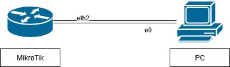
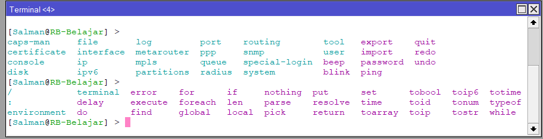
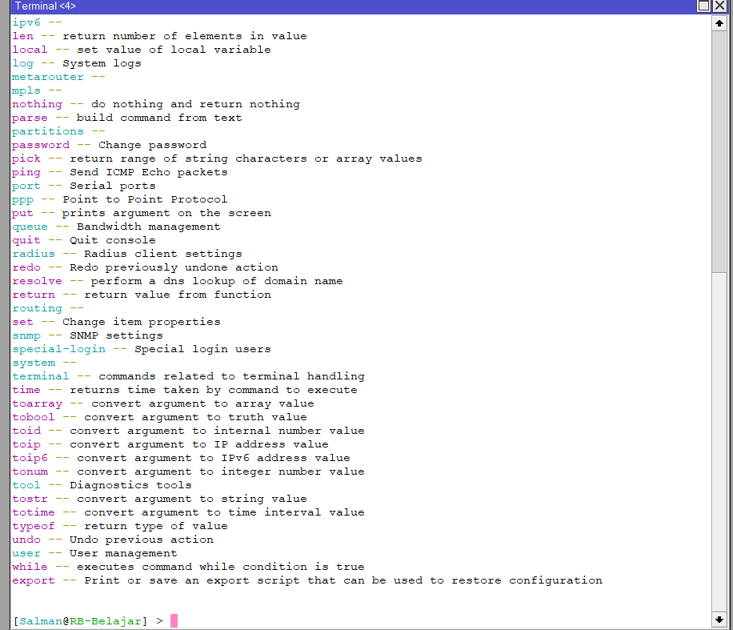

# Command-Line-Interface-(CLI)-atau-Terminal-pada-MikroTIk

Command Line Interface [CLI/Terminal] pada MikroTik

 

Selain menggunakan winbox yang sangat user friendly dengan mode GUI nya, MikroTik juga dapat dikonfigurasi menggunakan mode CLI (berbasis teks/text mode).\
Pada Repo sebelumnya, Mikrotik router OS dapat dikonfig melalui CLI / terminal menggunakan akses/remote via: Winbox (terminal), PuTTY(ssh dan telnet), cmd(telnet), console dan Aplikasi Mikrotik Pro.  

Mode CLI biasanya digunakan untuk user tingkat lanjut atau expert, terutama yang belajar menggunakan aplikasi GNS3 dan EVE-NG, karena lebih simple untuk langsung konfigurasi mikrotik tanpa harus menggunakan Winbox.

Berikut ini perintah-perintah dasar pada mikrotik melalui terminal:

Mengganti identitas mikrotik

    [admin@MikroTik] > system identity set name=RB-Belajar
    [admin@RB-Belajar] > 
    
     #(masukkan nama identity baru pada bagian name= )
Memberikan password admin

    [admin@RB-Belajar] > password
Setelah itu akan muncul tampilan untuk memasukkan password baru

    old-password:
    new-password:********
    confirm-new-password:********
    
     #(karena old password nya adalah password bawaan dari MikroTik (yaitu blank) maka bagian old password tidak perlu diisi) 
Membuat user baru dan password dengan hak akses full

    [admin@RB-Belajar] > user add name=Salman group=full password=admin123
    
     #(ada tiga jenis group:
     read = hanya bisa membaca tidak bisa mengonfigurasi
     write = dapat mengonfigurasi namun tidak dapat menambahkan user login baru dan melakukan reset configuration pada router
     full = mempunyai akses full dalam mengonfigurasi) 
Melihat user

    [admin@RB-Belajar] > user print
    Flags: E - expired, X - disabled
    #     NAME        GROUP        ADDRESS                       LAST-LOGGED-IN
    0     ;;; system default user
          admin       full                                       sep/12/2024 00:03:36
    1     Salman      full
    [admin@RB-Belajar] > 
Melihat Lisensi

    [admin@RB-Belajar] > system license print
      software-id: W716-FUJ3
           nlevel: 4
         features:
    [admin@RB-Belajar] > 
Mengganti nama interface dan Melihat interface

    [admin@RB-Belajar] > interface set name=Ether1-WAN ether1
    [admin@RB-Belajar] > interface set name=Ether2-LAN ether2
    [admin@RB-Belajar] > interface print
    Flags: D - dynamic, X - disabled R - running, S - slave
     #     NAME                               TYPE       ACTUAL-MTU L2MTU
     0  R  Ether1-WAN                         ether            1500  1598
     1  R  Ether2-LAN                         ether            1500  1598
     2     Ether3                             ether            1500  1598
     3     Ether4                             ether            1500  1598
     4     Ether5                             ether            1500  1598

     [admin@RB-Belajar] > 
Mengaktifkan DHCP Client

     [admin@RB-Belajar] > ip dhcp-client add interface=Ether1-WAN use-peer-dns=yes use-peer-ntp=yes add-default-root=yes
     [admin@RB-Belajar] > 
Memberikan IP Address 192.168.10.1/24 dan Melihat IP Address

     [admin@RB-Belajar] > ip address add address=192.168.10.1/24 interface=Ether2-LAN
     [admin@RB-Belajar] > ip address print
     Flags: X - disabled, i - invalid, D - dynamic
      #   ADDRESS            NETWORK         INTERFACE
      0   192.168.10.1/24    192.168.10.0    Ether2-LAN
     [admin@RB-Belajar] > 
Mengedit IP Address 192.166.10.1/24 menjadi 192.168.20.1/24 dan Melihat IP Address

     [admin@RB-Belajar] > ip address set=192.168.20.1/24 interface=Ether2-LAN
     numbers: 0
     [admin@RB-Belajar] > ip address print
     Flaags: X - disabled, i - invalid, D - dynamic
      #   ADDRESS            NETWORK         INTERFACE
      0   192.168.20.1/24    192.168.20.0    Ether2-LAN
     [admin@RB-Belajar] > 
Menambahkan perintah NAT dan Melihat konfigurasi NAT

     [admin@RB-Belajar] > ip firewall nat add chain=srcnat out-interface=Ether1-WAN action=masquerade
     [admin@RB-Belajar] > ip firewall nat print
     Flags: X - disabled, A - active, D - dynamic, 
     c - connect, s - static, r - rip, b - bgp, o - ospf, m - mme, 
     B - blackhole, U - unreachable, P - prohibit
      #      DST-ADDRESS        PREF-SRC        GATEWAY            DISTANCE
      0      0.0.0.0/0                          192.168.1.1               1
      1      192.168.20.0/24    192.168.20.1    Ether2-LAN                0
     [admin@RB-Belajar] > 
Menambahkan gateway dan Melihat gateway

     [admin@RB-Belajar] > ip route add gateway=192.168.1.1
     [admin@RB-Belajar] > ip route print
     Flags: X - disabled, i - invalid, D - dynamic
      0    chain=srcnat action=masquerade out-interface=Ether1-WAN
     [admin@RB-Belajar] > 
Menambahkan DNS dan Melihat DNS 

     [admin@RB-Belajar] > ip dns set servers=8.8.8.8 allow-remote-requests=yes
     [admin@RB-Belajar] > ip dns print
                          servers: 8.8.8.8
                  dynamic-servers:
                   use-doh-server:
                  verify-doh-cert: no
            allow-remote-requests: yes
             max-udp-packet-sizes: 4096
             query-server-timeout: 2s
              query-total-timeout: 10s
           max-concurrent-queries: 100
           
     [admin@RB-Belajar] > 
Melakukan ping

     [admin@RB-Belajar] > tool ping 192.168.20.1
      current: 1565.8Mbps
      average: 1268.6Mbps
      
     [admin@RB-Belajar] > 
Klik Tab pada Keyboard dua kali untuk melihat perintah apa saja yang dapat digunakan

Klik ? pada Keyboard untuk melihat semua perintah dan pengertiannya

Menyingkat perintah

     [admin@RB-Belajar] > ip ad pr
     Flaags: X - disabled, i - invalid, D - dynamic
      #   ADDRESS            NETWORK         INTERFACE
      0   192.168.20.1/24    192.168.20.0    Ether2-LAN
     [admin@RB-Belajar] > 
Ketik “..” untuk kembali ke direktori sebelumnya

     [admin@RB-Belajar] > ip
     [admin@RB-Belajar] /ip> .. 
     [admin@RB-Belajar] > 
# Kesimpulan
Mode CLI biasanya digunakan untuk user tingkat lanjut atau expert, terutama yang belajar menggunakan aplikasi GNS3 dan EVE-NG, karena lebih simple untuk langsung konfigurasi mikrotik, tanpa harus menggunakan winbox.
Pada mode CLI terdapat menu bantuan menggunakan tab dan tanda tanya(?) yang memudahkan user dalam menggunakan mode CLI.

Sekian yang dapat saya sampaikan, mohon maaf apabila ada salah kata atau kekurangan dalam penyampaian. Akhir kata, Wassalam
